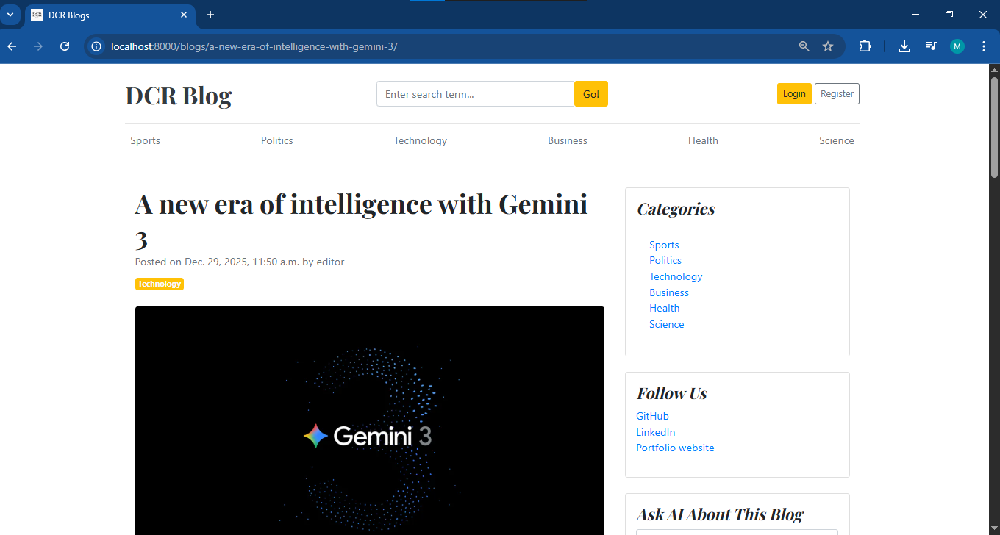
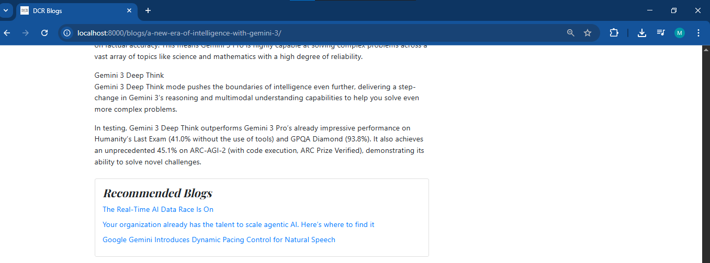
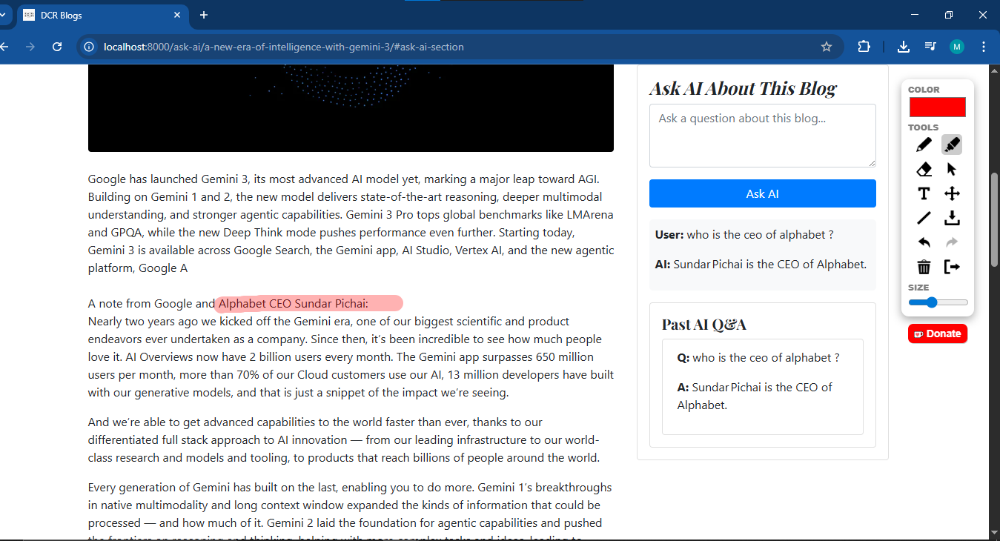
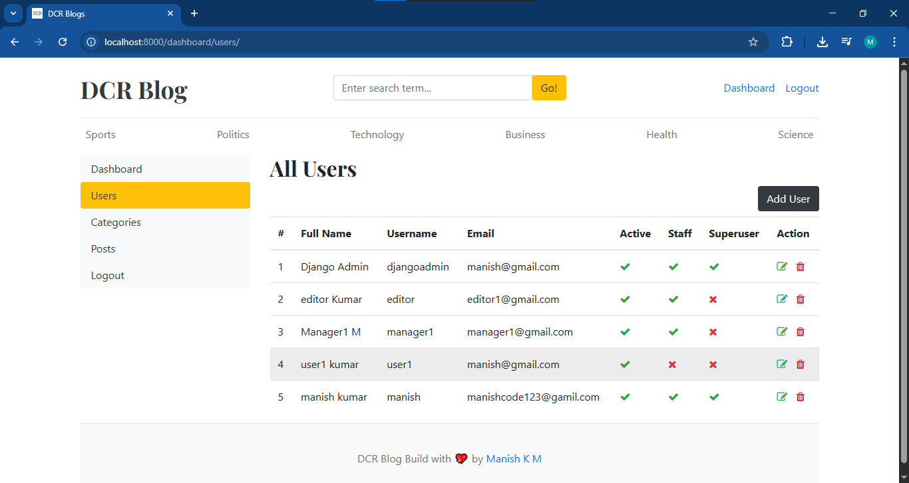
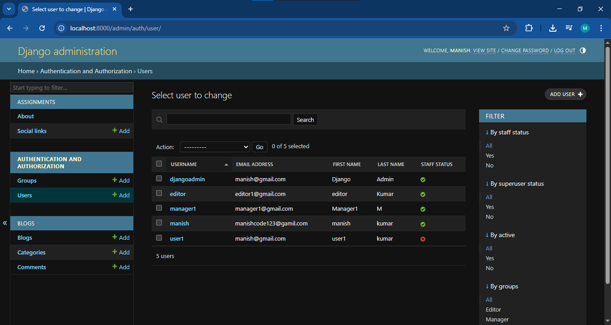
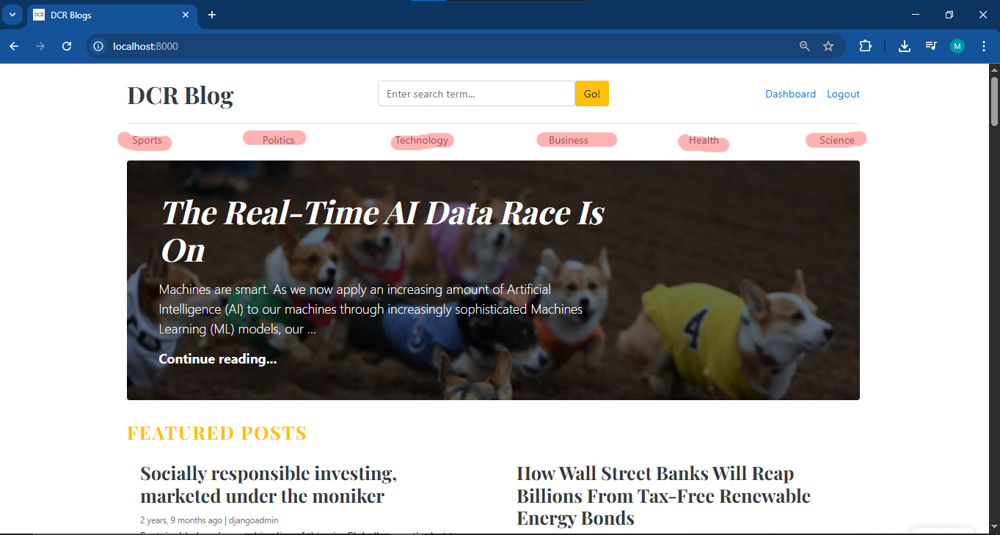

<p align="center">
  
</p>

<h1 align="center">DCR Blog</h1>

<p align="center">
A full-featured Django blogging platform with real-time recommendations and an AI-powered RAG chatbot.
</p>

<p align="center">
  <strong>Read • Write • Engage • Learn</strong>
</p>


---

# DCR Blog

A fully-featured Django-based blogging platform where users can read, create, edit, publish, and manage blog posts. The application includes category-based organization, a rich dashboard, real-time blog recommendations, commenting, and an AI-powered blog-specific chatbot using a RAG (Retrieval-Augmented Generation) pipeline.

---

## Features

### User Accounts

* User registration and login
* User dashboard showing:

  * Number of blogs created
  * Blogs categorized by types
* Admin-exclusive metrics:

  * Total users
  * Total categories
  * Global blog analytics
* Logout functionality

---

## Blog Management

Each blog post includes:

* Title
* Auto-generated unique slug
* Category selection
* Author
* Featured image
* Short description
* Full blog body
* Blog status (Draft or Published)
* Mark as Featured (shown on homepage)
* Auto timestamps

### Blog URL Structure

A clean, SEO-friendly format like:

```
http://localhost:8000/blogs/breast-cancer-and-genetics-know-your-risk/
```

### Blog Schema

```python
class Blog(models.Model):
    title = models.CharField(max_length=100)
    slug = models.SlugField(max_length=150, unique=True, blank=True)
    category = models.ForeignKey(Category, on_delete=models.CASCADE)
    author = models.ForeignKey(User, on_delete=models.CASCADE)
    featured_image = models.ImageField(upload_to='uploads/%Y/%m/%d')
    short_description = models.TextField(max_length=500)
    blog_body = models.TextField(max_length=10000)
    status = models.CharField(max_length=20, choices=STATUS_CHOICES, default="Draft")
    is_featured = models.BooleanField(default=False)
    created_at = models.DateTimeField(auto_now_add=True)
    updated_at = models.DateTimeField(auto_now=True)
```

---

## Categories

Default categories available:

* Sports
* Politics
* Technology
* Business
* Health
* Science

### Category Schema

```python
class Category(models.Model):
    category_name = models.CharField(max_length=50, unique=True)
    created_at = models.DateTimeField(auto_now_add=True)
    updated_at = models.DateTimeField(auto_now=True)
```

---

## Commenting System

Users can comment on any blog after logging in.

### Comment Schema

```python
class Comment(models.Model):
    user = models.ForeignKey(User, on_delete=models.CASCADE)
    blog = models.ForeignKey(Blog, on_delete=models.CASCADE)
    comment = models.TextField(max_length=250)
    created_at = models.DateTimeField(auto_now_add=True)
    updated_at = models.DateTimeField(auto_now=True)
```

---

## Real-Time Recommendation Engine

A semantic similarity engine recommends the best **Three** related blogs for every blog page.

### How It Works

* Embedding model: `sentence-transformers/all-MiniLM-L6-v2`
* Input to model:

  * Blog title
  * Blog short description
* Vector database: **ChromaDB**
* Similarity search runs dynamically
* No need to restart server when new blogs are added
* Recommendations update in real-time

---

## AI Chatbot (RAG-Powered)

Every blog page contains a chatbot that answers questions **specifically related to that blog**. and also managing the past history for the user

### Pipeline

1. Knowledge Base: Content of the current blog
2. Splitting:

   * Chunk size: 300 characters
   * Overlap: 120 characters
3. Embeddings:

   * Model: `sentence-transformers/all-MiniLM-L6-v2`
4. Vector Store: ChromaDB
5. Retriever:

   * `retriever.get_relevant_documents(question)`
   * Similarity search
6. Prompt construction
7. LLM: `openai/gpt-oss-20b`
8. Response formatting into HTML
9. If query is irrelevant to the blog:

   * Returns:

     ```
     This question is not relevant with respect to this blog post.
     ```

---

## Installation Guide

### 1. Install Python 3.9.13

Download from:
[https://www.python.org/ftp/python/3.9.13/python-3.9.13-amd64.exe](https://www.python.org/ftp/python/3.9.13/python-3.9.13-amd64.exe)

Add Python path to the Environment Variables.

Verify installation:

```bash
python --version
```

Expected output:

```
Python 3.9.13
```

---

### 2. Clone the Repository

```bash
git clone https://github.com/manishKrMahto/DCR-Blog.git
cd DCR-Blog
```

---

### 3. Create a Virtual Environment

```bash
python -m pip install virtualenv
python -m venv .venv
```

Activate it (VS Code auto-activation recommended).
```
# for windows
.venv\Scripts\activate
```

Upgrade pip:

```bash
python -m pip install --upgrade pip
```

---

### 4. Install Dependencies

```bash
pip install -r requirements.txt
```

---

### 5. Run the Application

```bash
python manage.py runserver
```

Open the browser:

```
http://localhost:8000/
```

---

## Demo Credentials

### Admin

```
username: manish
password: ashish@123
```

### User

```
username: user1
password: ashish@123
```

---

## Future Improvements

### 1. Reduce Recommendation Engine Latency
- Cache embeddings for previously processed blogs
- Use Faiss CPU index for faster similarity search
- Preload vector store during server start-up
- Add async background tasks for embedding generation

### 2. Improve RAG Chatbot Response Speed
- Enable embedding caching for each blog
- Reduce chunk size or switch to dynamic chunking
- Replace Chroma persistent storage with in-memory store for faster access
- Switch to a lighter LLM for shorter queries

### 3. SEO Enhancements
- Add OpenGraph meta tags
- Auto-generate sitemap.xml
- Add structured blog data (JSON-LD)

### 4. Advanced Editor for Blog Creation
- Replace textarea with a rich WYSIWYG editor (TipTap, CKEditor, Quill)
- Add image embedding inside blog body

### 5. Notifications & Engagement
- Email notifications for new comments
- Follow authors and receive updates
- Like / Bookmark blogs


---

## Screenshots

Below are sample sections where you can attach screenshots from the project.

### 1. Homepage


### 2. Blog Detail Page


### 3. Recommendation Section


### 4. AI Chatbot


### 5. User Dashboard


### 6. Admin Panel


### 7. Categories Page


---

## Reference

This project is inspired by the tutorial by Rathan:
[https://youtu.be/1-1ePcEDcqI?si=9sVbZl77Q14s_rOu](https://youtu.be/1-1ePcEDcqI?si=9sVbZl77Q14s_rOu)

New features added:

1. Real-time recommendation engine
2. Blog-specific AI chatbot
